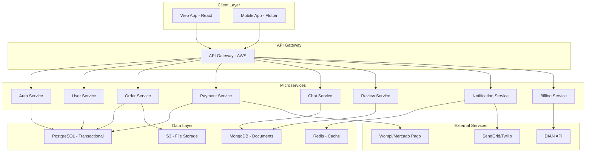

# Arquitectura Técnica - Fixi

## 📋 Visión General

**Fixi** implementa una arquitectura de microservicios escalable y segura, optimizada para un marketplace de servicios técnicos en tiempo real.

## 🏗️ Stack Tecnológico

### Backend
- **Framework:** Node.js con NestJS
- **Arquitectura:** Microservicios
- **Comunicación:** REST API + WebSockets
- **Base de Datos:** PostgreSQL (transaccional) + MongoDB (documentos)

### Frontend
- **Web:** React.js 18+ con TypeScript
- **Mobile:** Flutter (Dart)
- **State Management:** Redux Toolkit (Web) / Provider (Flutter)
- **UI Components:** Material-UI / Material Design

### Infraestructura
- **Cloud:** Amazon Web Services (AWS)
- **Región:** sa-east-1 (São Paulo)
- **Contenedores:** Docker + Kubernetes (ECS/EKS)
- **CI/CD:** GitHub Actions + AWS CodePipeline

## 🏛️ Arquitectura de Microservicios

### Servicios Core



### Descripción de Servicios

#### 1. Auth Service
- **Responsabilidad:** Autenticación y autorización
- **Tecnologías:** JWT, OAuth 2.0, bcrypt
- **Base de Datos:** PostgreSQL

#### 2. User Service
- **Responsabilidad:** Gestión de perfiles y usuarios
- **Funcionalidades:** CRUD usuarios, verificación de técnicos
- **Base de Datos:** PostgreSQL

#### 3. Order Service
- **Responsabilidad:** Gestión del ciclo de vida del servicio
- **Funcionalidades:** Creación, seguimiento, finalización de órdenes
- **Base de Datos:** PostgreSQL

#### 4. Payment Service
- **Responsabilidad:** Procesamiento de pagos y distribuciones
- **Integraciones:** Wompi, Mercado Pago
- **Base de Datos:** PostgreSQL

#### 5. Chat Service
- **Responsabilidad:** Comunicación real-time
- **Tecnologías:** Socket.io, WebSockets
- **Base de Datos:** MongoDB

#### 6. Review Service
- **Responsabilidad:** Sistema de calificaciones y reseñas
- **Funcionalidades:** Calificación bidireccional, moderación
- **Base de Datos:** MongoDB

#### 7. Notification Service
- **Responsabilidad:** Envío de notificaciones
- **Canales:** Push, Email, SMS
- **Integraciones:** SendGrid, Twilio

#### 8. Billing Service
- **Responsabilidad:** Facturación electrónica DIAN
- **Integraciones:** API DIAN, Proveedores tecnológicos
- **Base de Datos:** PostgreSQL

## 🔒 Seguridad y Cumplimiento

### Seguridad
- **Cifrado:** TLS 1.3 en todas las comunicaciones
- **Autenticación:** JWT con refresh tokens
- **Autorización:** Role-Based Access Control (RBAC)
- **Validación:** Input validation y sanitización
- **Audit Logs:** Registro completo de actividades

### Cumplimiento Normativo
- **Ley 1581/2012:** Habeas Data completo
- **DIAN:** Facturación electrónica integrada
- **PCI-DSS:** Cumplimiento para procesamiento de pagos
- **GDPR-like:** Protección de datos personales

## 📊 Monitoreo y Observabilidad

### Métricas de Aplicación
- **Performance:** Response time, throughput
- **Disponibilidad:** Uptime, health checks
- **Errores:** Error rates, exception tracking
- **Business:** GMV, órdenes completadas, usuarios activos

### Infraestructura
- **AWS CloudWatch:** Métricas y logs
- **AWS X-Ray:** Tracing distribuido
- **Prometheus/Grafana:** Dashboards personalizados
- **ELK Stack:** Centralización de logs

## 🚀 Escalabilidad y Alta Disponibilidad

### Horizontal Scaling
- **Auto Scaling:** CPU y memoria basados en demanda
- **Load Balancing:** ALB con health checks
- **Database:** Read replicas y connection pooling
- **Caching:** Redis clustering

### Disaster Recovery
- **Multi-AZ:** Distribución entre zonas de disponibilidad
- **Backups:** Automáticos y cross-region
- **RPO/RTO:** < 1 hora / < 4 horas
- **Failover:** Automático y transparente

## 🔧 Desarrollo y Despliegue

### Entornos
- **Development:** Local con Docker Compose
- **Staging:** Réplica de producción
- **Production:** AWS con auto-scaling

### CI/CD Pipeline
```yaml
Pipeline:
  - Code Quality (ESLint, Prettier, Tests)
  - Security Scan (Snyk, npm audit)
  - Build & Test
  - Deploy to Staging
  - E2E Tests
  - Deploy to Production
  - Health Checks
```

### Testing Strategy
- **Unit Tests:** Jest/Supertest (>90% coverage)
- **Integration Tests:** Docker-compose + test containers
- **E2E Tests:** Cypress/Playwright
- **Load Testing:** K6 para estrés de APIs

---

**Última actualización:** 20 de octubre de 2025